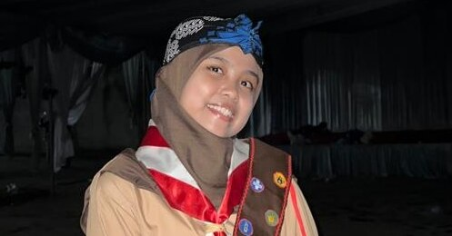

<!-- Animated Header -->
<h1 align="center">✨ Hi there, I'm Wardah ✨</h1>
<h3 align="center">🌸 Web & App Design | Cooking | E-learning | Travelling 🌸</h3>

<!-- Profile Picture -->

  

---

## 👩‍💻 About Me  
🌍 I'm **Wardah**, a creative soul passionate about design and life.  
✈️ I love **travelling**, 🍳 experimenting in the **kitchen**, and 🤝 making new **friends**.  
💡 Always curious, always learning, always creating!  

---

## 📊 GitHub Stats & Activity  

  <!-- Profile Views -->
  

  <!-- Stats Card -->
  
  
  <!-- Top Languages -->
  

  <!-- Contribution Graph -->
  

  <!-- Trophies -->
  

---

## 🛠️ Tech Stack  

  

---

## 🚀 Featured Projects  
- 🌟 [Creative Web Design](https://github.com/wardahnur)  
- 🍰 [Cooking & Recipe E-learning](https://github.com/wardahnur)  
- 📱 [Mobile App UI Prototype](https://github.com/wardahnur)  

---

## 📬 Connect With Me  

  
  

---

✨ *"Life is a colorful journey — I choose to paint mine with design, food, and friendship."* ✨
